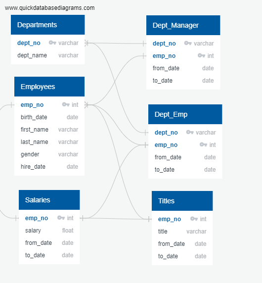
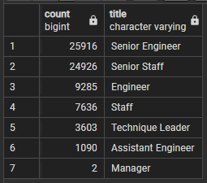
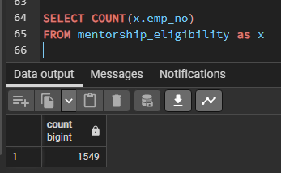
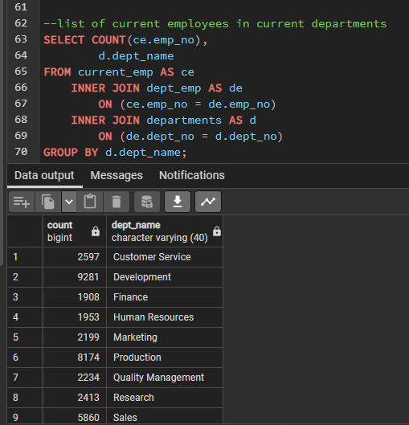
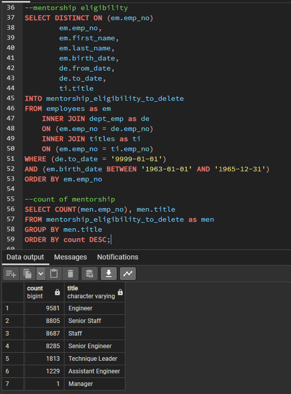

# An analysis of the upcoming "silver tsunami" at Pewlett Hackard (PH)

## Overview of Project
This project will help future-proof PH in the impending "silver tsunami" of a number of people retiring soon.

### Purpose
This project uses 6 tables containing employee and department information to perform employee research like how many employees will be retiring in the next few years and how many positions need to be filled. The ERD as shown below:

## Analysis and Challenges
Since we started with 6 basic tables, in the form of csv files, I have used SQL (on Postgresql) to create other meaningful table to help Bobby, the HR analyst at PH, prepare retirement packages for those employees about to retire, and provide a manager with other purposeful information based on specific departments, in hope of proposing a part-time mentorship program to the newer folks on the workforce by the employees about to retire; to keep business going steadily until PH gets up to date with its internal employee management system.

## Results

1. Of the 72,458 people retiring, there are 25,916 Senior Engineers, 24,926 Senior Staff, 9,285 Engineers, 7,636 Staff, 3,603 Technique Leader, 1,090 Assistant Engineer and 2 Managers, as shown below:

2. About 70% of the people retiring hold a Senior position at PH. This will help promote entry-level positions to seniority-level.

3. Looking at employees born in the year 1965, only 1,549 employees are eligible for the mentorship program.

4. With the mentorship program, PH can get some badly needed time by training the existing workforce and promoting them, while having entry-level positions to backfill, which is less hard than filling a senior-level position.

## Summary
* About 72,458 roles will need to be filled as the "silver tsunami" begins to make an impact.
* There are enough qualified, retirement-ready employees in the departments to mentor the next generation of PH employees since we noted over 70% of retiring employees hold senior positions.  

Additional queries or tables that will help provide more insights in the upcoming "silver tsunami" could be:
1. PH can look over at a departmental level, which department should be tackled first, after knowing now what are the titles retiring.

2. If we increase the range of mentorship eligibility to look over more than a year e.g. 3 years, say 1963-1965, the amount of employees eligible increased significantly, as shown below. By promoting existing employees, we save a lot of resources and time hiring on senior roles, and contribute to employee happiness.

